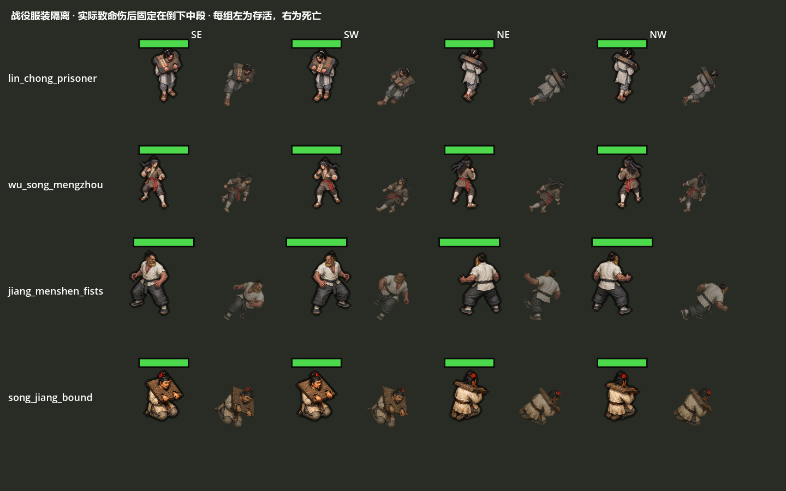

# 战役死亡造型 QA · 2026-09-06

最终1,172项通过；另跑无画面入口252项通过，未重复累加到总数。`before/`为73fb3a8的Art进程内控制，286项中62项预期失败；`after/`为当前Art，286项通过。两张矩阵均为实际32个Unit，其中16个由真实致命伤进入死亡。`control/`保存原脚本和可复现入口；不会替换工作区源码。

动作/资源回归报告与日志保留：campaign_art162、wu_song127、lu_zhishen125、jiang_menshen126、song_runtime248、wall46、contact22、gate30。`gate/`同时保存祝家庄主门、偏门与总览。`coverage_summary.json`是历史全量覆盖工具本轮运行的摘要，不代表新的素材覆盖完成。

`validation_receipt.json`记录本轮源输入、Git规范化blob及证据SHA256。`fixture_initial_failure.log`是最初方法签名冲突的夹具失败；已修正，不计入通过项。来源链和执行方式见[实现](../../docs/CAMPAIGN_TERMINAL_COSTUME_20260906.md)。

本批只关闭死亡时换装缺陷。专用四向死亡、林冲剩余方向、全库美术、真人八关/驻守、教程、战斗恢复、长期性能与发行验收仍待完成。
